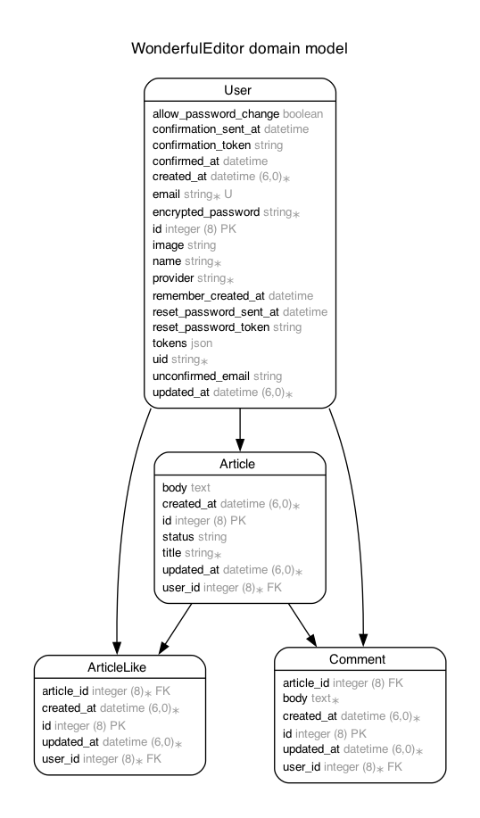

# アプリURL
https://wonderful-editor-nb6h.onrender.com/

#　サービス概要
Qiitaをイメージしたマークダウン記法に対応した記事共有アプリです。

# サービスを開発した背景
スクールで学習したRuby、Railsの最終課題として取り組みました。

# 画面や機能の説明
・RSpecを用いたテストコードを実装
・ユーザー登録とログイン機能、投稿のCRUD機能といった基本機能を実装しています。
・gem「devise」を活用しログイン機能を実装

# 主な使用技術
## バックエンド
・Ruby 3.1.3
・Rails 6.1.7.10
・HTML
・CSS
・Git
・RSpec
・Docker
・devise

## フロントエンド
・HTML

## データベース
・MySQL 　

# ER図

